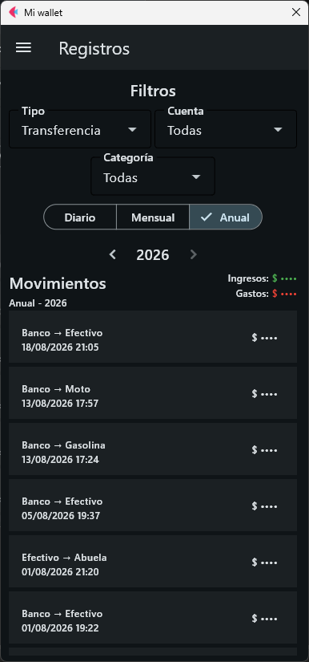
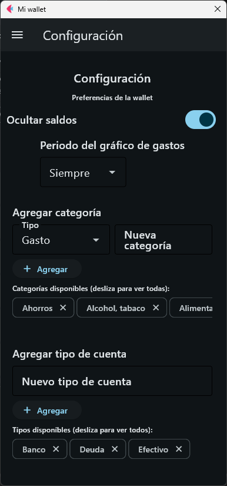

# Mi Wallet

Aplicación personal de finanzas desarrollada con **Python y Flet** para gestionar cuentas, movimientos, transferencias y balances desde una interfaz visual.

La aplicación funciona con **persistencia local**, sin depender de un backend externo ni de una base de datos remota.

Su objetivo es concentrar en una sola cartera la información financiera del usuario y ofrecer una consulta rápida del estado actual, el historial y diferentes indicadores para facilitar la gestión cotidiana.

## Vista previa

Las capturas reales de la aplicación se encuentran en la carpeta [`imagenes/`](imagenes/).

| Inicio | Registros | Transferencias |
| --- | --- | --- |
|  |  |  |

| Nuevo gasto | Nueva transferencia | Nueva cuenta |
| --- | --- | --- |
|  |  |  |

| Configuración |
| --- |
|  |

## Funcionalidades

### Cuentas y balance

- Crear, editar y eliminar cuentas.
- Clasificar cuentas mediante tipos configurables, como efectivo, banco, deudas, inversiones o ahorros.
- Crear nuevos tipos de cuenta.
- Consultar el saldo individual y el balance global de la wallet.
- Generar automáticamente movimientos de ajuste cuando corresponde.

### Movimientos

Cada ingreso o gasto incluye información como cuenta, tipo, categoría, descripción, importe y fecha.

Los registros pueden consultarse mediante filtros por:

- cuenta;
- tipo;
- categoría;
- rango de fechas.

Los movimientos se consultan por periodos para evitar cargar innecesariamente todo el historial al utilizar la aplicación.

La vista de inicio muestra únicamente información reciente, mientras que la sección de registros permite consultar periodos más amplios.

La `Wallet` conserva y coordina el historial general de movimientos, evitando que cada cuenta mantenga una copia independiente de sus registros.

### Transferencias

Una transferencia relaciona una cuenta de origen con una cuenta de destino mediante un identificador compartido.

En la interfaz se presenta como **una única tarjeta de transferencia**, aunque internamente afecte al saldo de dos cuentas.

Las transferencias también pueden consultarse desde la sección de registros mediante sus filtros correspondientes.

### Predicciones y análisis

La aplicación incorpora predicciones basadas en los datos registrados para ofrecer una referencia sobre la evolución financiera esperada.

Actualmente esta parte se encuentra en desarrollo y será ampliada con herramientas de análisis más detalladas.

### Configuración

La aplicación cuenta con una sección de configuración destinada a personalizar distintos aspectos de la wallet y mejorar la experiencia de uso.

Entre las opciones actuales se incluyen configuraciones relacionadas con la privacidad, como la posibilidad de ocultar los saldos, además de preferencias sobre gráficos, categorías y tipos de cuenta.

### Importación y exportación

La aplicación permite importar y exportar información mediante CSV.

Actualmente, la importación de archivos de **Money Manager** requiere este formato fijo de columnas, separadas por `;`:

```text
account;category;currency;amount;ref_currency_amount;type;payment_type;payment_type_local;note;date;gps_latitude;gps_longitude;gps_accuracy_in_meters;warranty_in_month;transfer;payee;labels;envelope_id;custom_category
```

La exportación permite crear copias de respaldo de la información actual o trabajar con los datos fuera de la aplicación.

La persistencia local permite conservar los datos incluso después de actualizar o reinstalar la aplicación en Android, siempre que el almacenamiento de datos de la aplicación se conserve en el dispositivo.

## Flujo principal

1. Crear o seleccionar las cuentas financieras.
2. Registrar ingresos, gastos o transferencias.
3. Consultar balances y registros mediante filtros.
4. Revisar la información disponible en el inicio.
5. Revisar las predicciones disponibles.
6. Personalizar la aplicación desde Configuración.
7. Guardar automáticamente los cambios en el almacenamiento local.
8. Importar o exportar información cuando sea necesario.

## Arquitectura

El proyecto separa la interfaz, la lógica de negocio, el dominio y la persistencia:

```text
project/
├── main.py
├── backend/
│   ├── models/
│   ├── persistence.py
│   ├── import_export.py
│   └── wallet_services.py
├── services/
├── persistence/
├── ui/
├── tests/
├── data/
└── build/
```

- **Modelos:** representan `Account`, `Movement` y `Wallet`.
- **Servicios:** coordinan cuentas, movimientos, transferencias, balances y predicciones.
- **Persistencia:** administra el almacenamiento local y el intercambio de información mediante CSV.
- **Interfaz:** Flet organiza la navegación, los formularios, los componentes visuales y las vistas de consulta.
- **Pruebas:** cubren distintas partes del dominio, transferencias, navegación, importación y componentes de la interfaz.

La interfaz actual fue reconstruida para priorizar la experiencia de uso y reducir la dependencia de una visualización permanente del historial de movimientos.

## Tecnologías

- Python 3.11.3
- Flet 0.86.5
- JSON para persistencia local
- CSV para importación y exportación
- Pytest para pruebas automatizadas

## Descargar

La aplicación puede descargarse desde el archivo [`download.zip`](download.zip), disponible en este mismo repositorio.

El archivo contiene la versión preparada para utilizar la aplicación en **Android**.

Actualmente la versión pública está orientada principalmente a móviles Android. La versión de escritorio todavía requiere algunos ajustes visuales.

## Compatibilidad

La aplicación está diseñada principalmente para **Android**, aunque el proyecto utiliza una base de código multiplataforma mediante Flet.

Durante su desarrollo se realizaron pruebas específicas para resolver diferencias entre escritorio y Android, especialmente en interacción, selección de archivos y persistencia de datos.

## Estado del proyecto

Mi Wallet cuenta actualmente con el flujo principal de gestión financiera:

- cuentas;
- movimientos;
- transferencias;
- balances;
- filtros por periodo;
- predicciones;
- configuración;
- persistencia local;
- importación y exportación;
- pruebas automatizadas.

El proyecto continúa evolucionando a partir de pruebas de uso real.

Las siguientes mejoras estarán enfocadas principalmente en ampliar el análisis financiero, incorporar funcionalidades específicas para deudas e inversiones y añadir cálculos automáticos relacionados con intereses y objetivos de ahorro.

## Roadmap

### Fase 1 — Wallet funcional

✅ **Finalizada**

Implementación del flujo principal de cuentas, movimientos, transferencias, balances, persistencia, importación/exportación y pruebas.

### Fase 2 — Adaptación Android y compatibilidad

✅ **Finalizada**

Adaptación de la aplicación para Android y resolución de problemas específicos de plataforma.

### Fase 3 — Pruebas de uso real

✅ **Finalizada**

El uso cotidiano permitió detectar problemas de navegación, rendimiento y comodidad, provocando cambios importantes en el diseño de la aplicación.

### Fase 4 — Reorganización visual, UX y estética

✅ **Finalizada**

Se reconstruyó prácticamente toda la interfaz y el frontend, estableciendo una nueva estructura visual, nuevos formularios, configuración, vistas por periodos y un enfoque centrado en productividad.

### Fase 5 — Estadísticas y predicciones

🟢 **En desarrollo**

Ampliación de los gráficos, estadísticas, análisis y predicciones disponibles para el usuario.

### Fase 6 — Deudas, inversiones y ahorros

⏳ **Pendiente**

Incorporación de sistemas específicos para gestionar deudas, inversiones y objetivos de ahorro, incluyendo cálculos automáticos de intereses.

### Fase 7 — Pulido técnico

⏳ **Pendiente**

No se plantea actualmente una fase de optimización masiva independiente. La arquitectura y la interfaz actual ya han reducido considerablemente los problemas de rendimiento identificados durante las primeras versiones.

Esta fase queda reservada para corregir detalles técnicos, simplificar elementos que lo necesiten y mejorar la estabilidad general.

### Fase 8 — Prueba final

⏳ **Pendiente**

Periodo prolongado de uso para verificar la estabilidad de todas las funcionalidades después de completar las etapas de desarrollo principales.

## Filosofía del proyecto

Mi Wallet se desarrolla de forma incremental y a partir del uso real.

Las decisiones de diseño y arquitectura se revisan cuando la experiencia práctica demuestra que una solución puede mejorarse.

El objetivo no es añadir funcionalidades por cantidad, sino construir una herramienta que resulte **rápida, práctica y agradable de utilizar en el día a día**.
